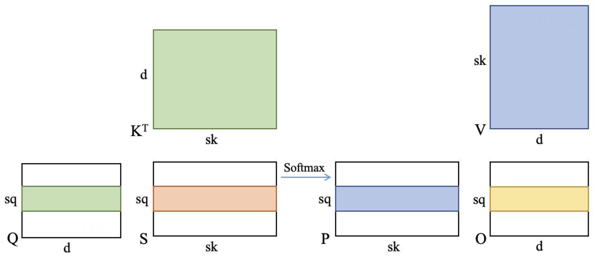
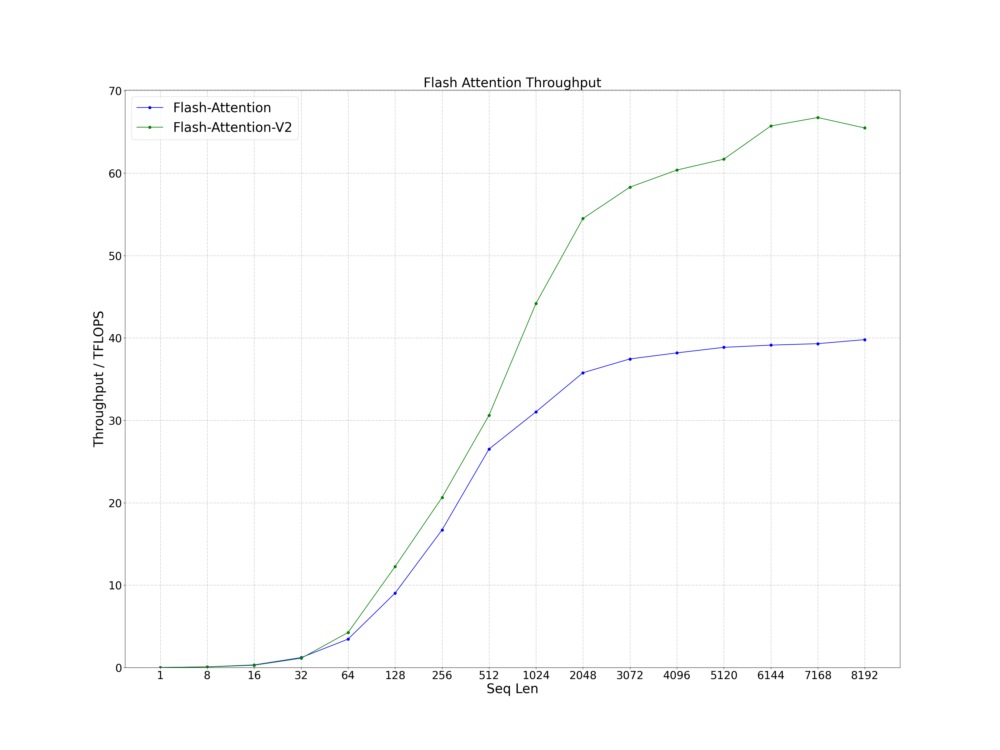
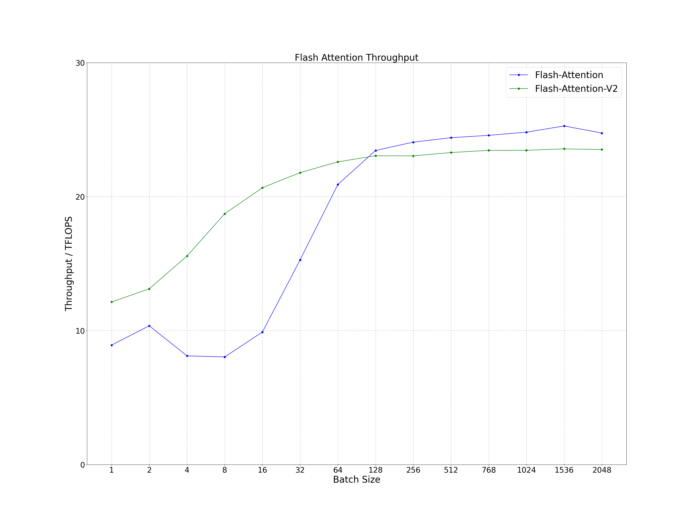
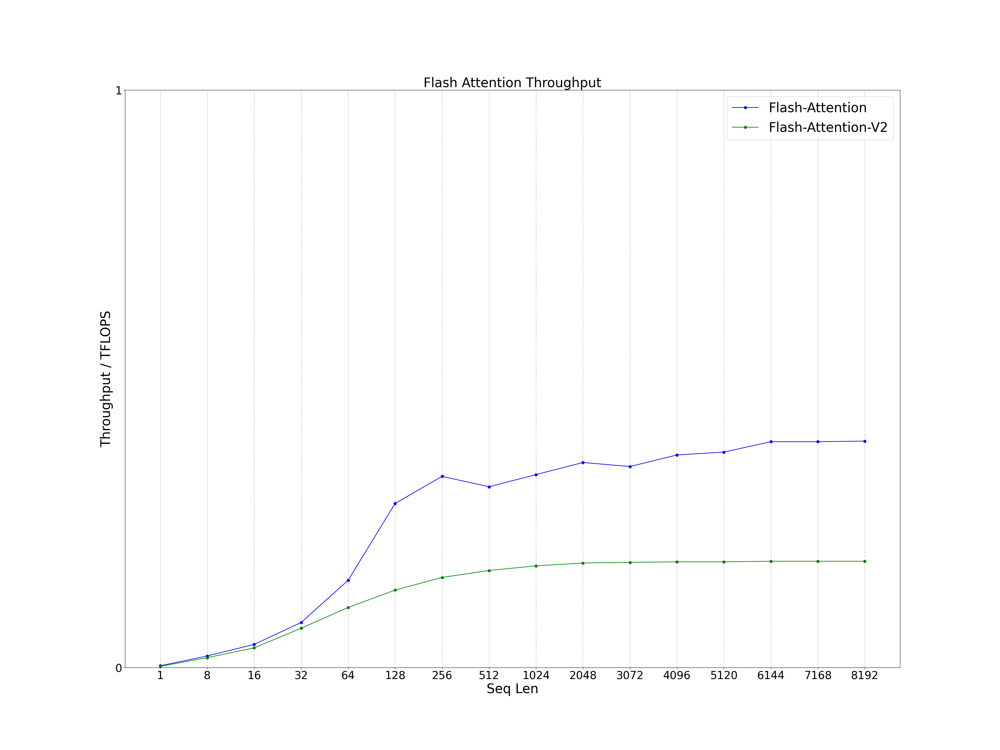
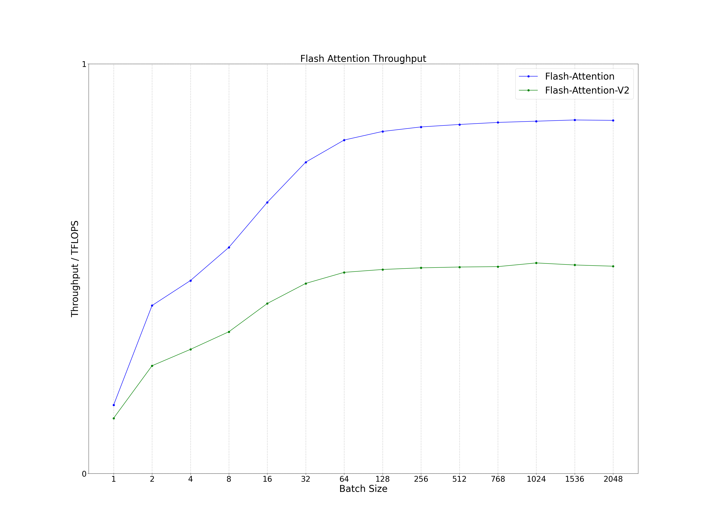
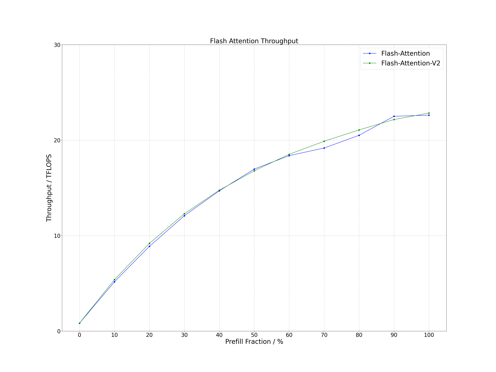

# Flash Attention Inference
Performance of the C++ interface of Flash Attention and Flash Attention v2 in large language model (LLM) inference scenarios. The calculation expression is as follows, where the precision of tensor Q, K, V and O is FP16. Remove redundant code from Flash Attention that has nothing to do with inference, such as backward, dropout, bf16 and torch dependencies, so you can easily integrate this Flash Attention into LLM inference programs. In addition, Flash Attention and Flash Attention v2 have been modified to support group query attention (GQA) / multi query attention (MQA), hybrid by prefill and decoding and attention with linear biases (ALiBi) inference scenarios.
```
O = Softmax(Q * K^T) * V
```



# Support
- GQA/MQA Inference: Group query attention / multi query attention inference
- Hybrid Inference: Hybrid inference by prefill and decoding
- ALiBi Inference: Attention with linear biases inference

# Compile
## Environment
- OS: Linux
- Cmake Version: >= 3.16
- GCC Version: >= 5.0
- CUDA Version: >= 11.4
- Others: gflags, ccache
```
sudo apt-get install libgflags-dev ccache
```

## Clone
```
git clone https://github.com/Bruce-Lee-LY/flash_attention_inference.git
```

## Build
### NVIDIA A100
```
cd flash_attention_inference
./build.sh -a 80 -t Release -b OFF
./build.sh -a 80 -t Debug -b OFF
```

### RTX3080Ti / RTX3090 / RTX A6000
```
cd flash_attention_inference
./build.sh -a 86 -t Release -b OFF
./build.sh -a 86 -t Debug -b OFF
```

# Run Sample
```
./run_sample.sh
```

# Performance
Process the data in the log and plot it as a line chart.

```
cd tools/performance
./performance.sh
```

## RTX3090
- CUDA Version: 11.8
- Head Num: 32
- Head Dim: 128

### Prefill
#### Seq Len
The performance of both is similar for short sequences and Flash Attention v2 performs well in long sequences. It can increase by about 60%.
- Batch Size: 1
- Seq Q: Seq Len
- Seq K: Seq Len



#### Batch Size
When the batch size is small, the Flash Attention v2 performance is better. When the batch size is large, the performance of the two kernels is comparable.
- Batch Size: Batch Size
- Seq Q: 128
- Seq K: 128



### Decoding
#### Seq Len
The performance of both is similar for short sequences and Flash Attention performs well in long sequences. It can increase by about 100%.
- Batch Size: 1
- Seq Q: 1
- Seq K: Seq Len



#### Batch Size
The Flash Attention performance is better than Flash Attention v2 regardless of batch size.
- Batch Size: Batch Size
- Seq Q: 1
- Seq K: 128



### Hybrid
Regardless of the ratio of Prefill to Decoding, Flash Attention and Flash Attention v2 are similar in performance.
- Batch Size: 100
- Seq Q: 128
- Seq K: 128



# Reference
## [flash-attention](https://github.com/Dao-AILab/flash-attention)
- Flash Attention: v1.0.9
- Flash Attention v2: v2.1.0

## [cutlass](https://github.com/NVIDIA/cutlass)
- cutlass: v3.1.0
